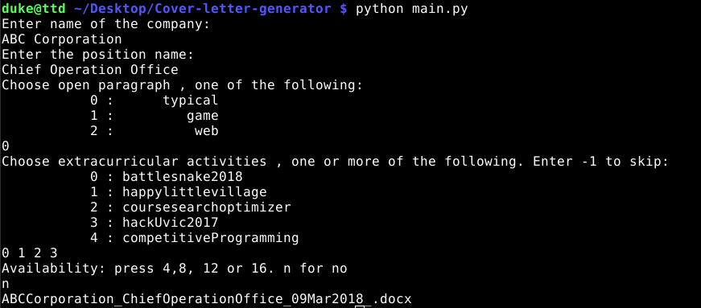
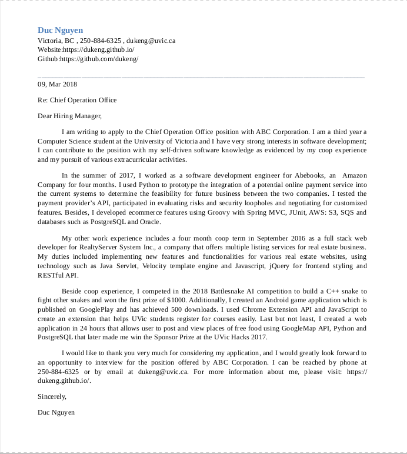

# Cover Letter Generator

On applying for jobs, it is difficult to keep track of cover letters you send out. Quite often, the amount of job application can make writing a cover letter error prone and small mistakes such as wrong company name, typos and formatting can sometimes cost you an opportunity to getting your dream job.


Cover Letter Generator solves all the problems above. It gets rid of simple mistakes and helps you automate writing and managing cover letters. Of course you can still add customized cover letters. Everything you added would be saved under sample.json for future reference. 

## Getting Started

Clone the project.

Need to have python3 and pip3 to install requirements

Run:
```
pip install requirements.txt
sudo apt-get install abiword
```
Inside the folder create a .env file and populate it with your personal information
```
NAME=Henri Vandersleyen
ADDRESS=Somewhere BC
PHONE=XXX-XXX-XXXXX
MAIL=something@me.com
WEBSITE=yourUrl
GITHUB=yourUrl
```
## How to use

Run:
```
make
```
or 

```
python main.py
```

The program will prompt a list of questions and after some simple answers it will generate a cover letter.


Example of the prompt:


Sample cover letter generated by the above prompt:



## Structure of the cover letter

The information of the company as well as personal information are stored in sample.json
Add personal information and your paragraphs by modifying sample.json

Here is my core structure of the cover letter

* Contact Information: name, address, phone, email, website, github, etc.
* Open Paragraph: Greeting paragraph stating the intention and purpose of the cover letter
* First coop: experience from my first coop
* Second coop: experience from my second coop
* Extra curricular activities: Choose up to 4 from a pools of software activities that I pursue.
* Final pararaph: closing paragraph, thank the company and state the availability time(optional)


## Built With

* [python-docx](https://python-docx.readthedocs.io/en/latest/) - python doc library
* [abiword](https://www.abisource.com/) - Convert word to pdf

## Future Development (TODOs)

* Make the structure more flexible
* Add tags to archived paragraphs

## License

This project is licensed under the MIT License - see the [LICENSE.md](LICENSE.md) file for details
